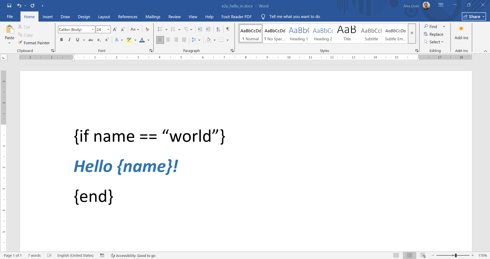
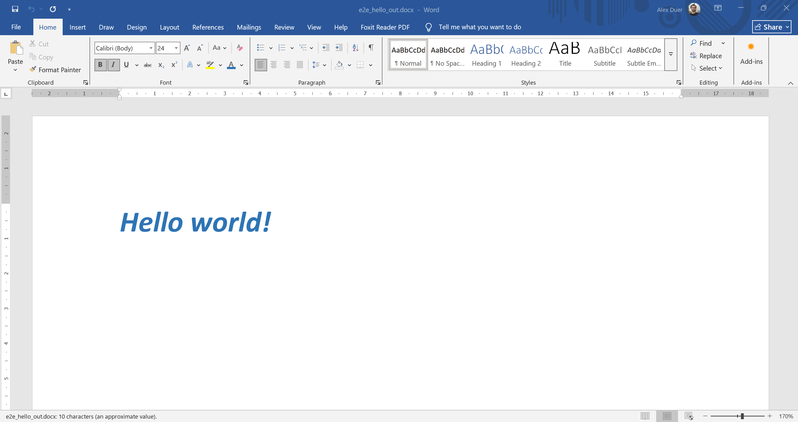

<p align="center">
  <h1 align="center">DocStencil</h1>
  <p align="center">
    <strong>Generate DOCX files from templates in Java and Kotlin</strong>
  </p>
</p>

<p align="center">
  <a href="https://central.sonatype.com/artifact/com.docstencil/docstencil-core"></a>
  <a href="docstencil-core/LICENSE"></a>
</p>

<p align="center">
  <a href="https://docstencil.com/docs">Documentation</a> •
  <a href="https://docstencil.com/docs/basics">Examples</a> •
  <a href="https://github.com/docstencil/docstencil-core/issues">Report Bug</a>
</p>

---

## What is DocStencil?

DocStencil is a document templating engine for the JVM that lets you generate Word documents (DOCX) from templates. Design your templates in Microsoft Word using familiar `{placeholder}` syntax, then render them with your data to produce professional documents.

**Use cases:**
- **Invoices & Receipts** — Generate billing documents with line items, totals, and customer details
- **Contracts & Agreements** — Create legal documents with dynamic clauses and signatures
- **Reports** — Build data-driven reports with tables, charts, and formatted numbers

Templates can be edited by anyone familiar with Word — no programming knowledge required. Your team can update document layouts, styles, and content without touching code.

## Key Features

- **Placeholder replacement**: Use simple placeholders: `{name}` 
- **Loops & Conditionals**: Generate dynamic tables and show/hide sections with `{for}` and `{if}`
- **Nested Data**: Access complex data structures with dot notation and function calling: `{customer.address.city}`, `{customerService.get(invoice.getCustomerId()).getName()}`
- **Formatting**: Format dates and numbers with built-in functions: `{$format(date, "MMMM dd, yyyy")}`
- **Preserves Styles**: Your Word styles, fonts, and layouts stay intact

## Quick Start

### Requirements

- **JDK 8** or higher

### Installation

<details>
<summary><b>Maven</b></summary>

```xml
<dependency>
    <groupId>com.docstencil</groupId>
    <artifactId>docstencil-core</artifactId>
    <version>0.1.2</version>
</dependency>
```

</details>

<details>
<summary><b>Gradle (Kotlin)</b></summary>

```kotlin
implementation("com.docstencil:docstencil-core:0.1.2")
```

</details>

<details>
<summary><b>Gradle (Groovy)</b></summary>

```groovy
implementation 'com.docstencil:docstencil-core:0.1.2'
```

</details>

### Hello World

**1. Create a Word template:**



```
{if name == "world"}
Hello {name}!
{end}
```

**2. Render with your data:**

<details open>
<summary><b>Kotlin</b></summary>

```kotlin
import com.docstencil.core.api.OfficeTemplate

fun main() {
    val template = OfficeTemplate.fromFile("template.docx")
    val result = template.render(mapOf("name" to "world"))
    result.writeToFile("Output.docx")
}
```

</details>

<details>
<summary><b>Java</b></summary>

```java
import com.docstencil.core.api.OfficeTemplate;
import java.util.Map;

public class Main {
    public static void main(String[] args) {
        var template = OfficeTemplate.fromFile("template.docx");
        var result = template.render(Map.of("name", "world"));
        result.writeToFile("Output.docx");
    }
}
```

</details>

**3. Result:**



```
Hello World!
```

## Template Syntax

### Variables

Access nested properties in maps, POJOs with getters, records, and data classes with dot notation:

```
Ship to: {customer.address.street}, {customer.address.city}
```

### Loops

Repeat content for each item in a list or table row:

```
{for item in items}
- {item.name}: ${item.price}
{end}
```

| Product | Quantity | Price |
|---------|----------|-------|
| {for line in orderLines}{line.product} | {line.qty} | ${line.price}{end} |

### Conditionals

Show content based on conditions:

```
{if invoice.subtotal >= 100 and !user.registered}
Use code COUPON10 to get 10% off your next order!
{end}
```

### Other features

DocStencil has a rich and expressive templating language that supports:

- Formatting of dates and numbers
- Pipe notation with lambdas
- Inserting raw XML
- Inserting links
- and much more ...

## Documentation

For comprehensive guides and API reference, visit the **[Documentation](https://docstencil.com/docs)**.

- [Quickstart Guide](https://docstencil.com/docs)
- [Template Basics](https://docstencil.com/docs/basics)
- [Built-in Functions](https://docstencil.com/docs/template-language/builtin-functions)
- [Pro Features](https://docstencil.com/docs/pro-modules/images)

## License

The `docstencil-core` module is dual-licensed under the [Apache License 2.0](https://www.apache.org/licenses/LICENSE-2.0) and [MIT License](https://opensource.org/licenses/MIT). See [docstencil-core/LICENSE](docstencil-core/LICENSE) for details.
